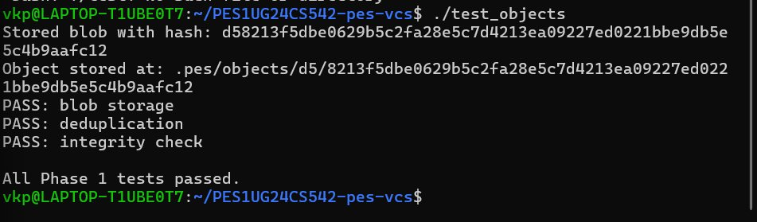
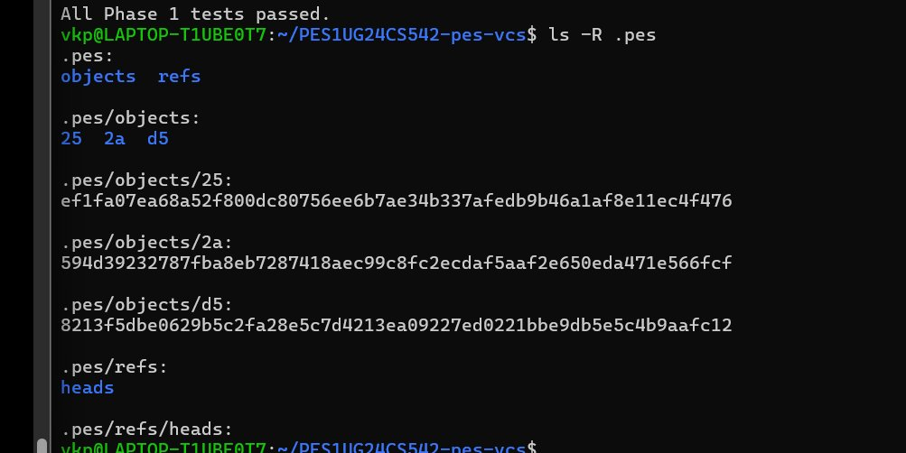
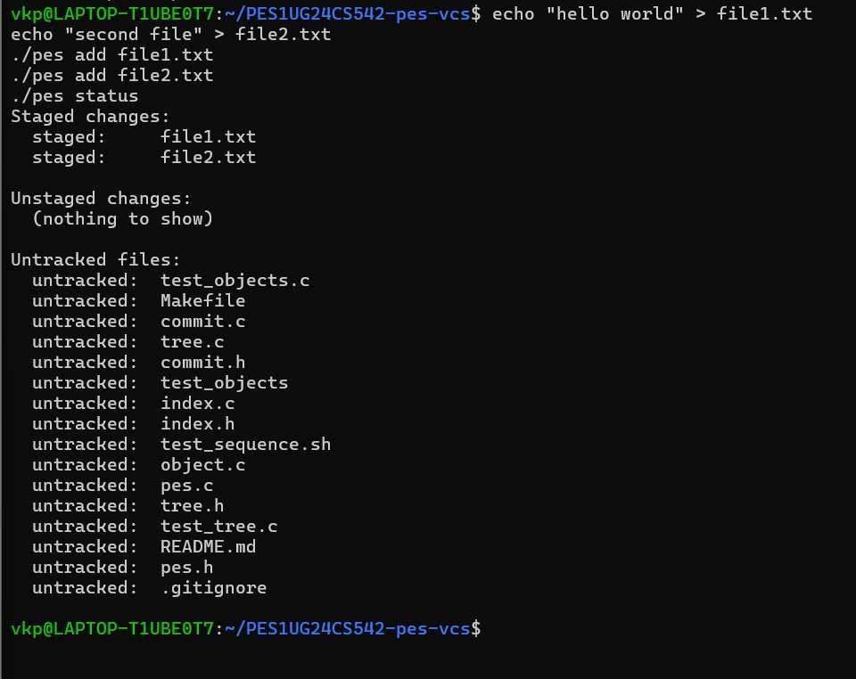
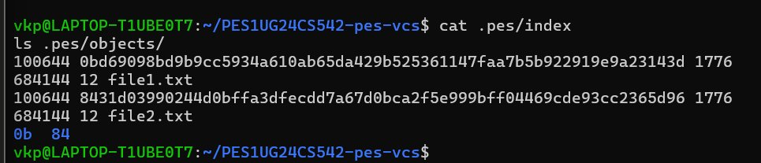
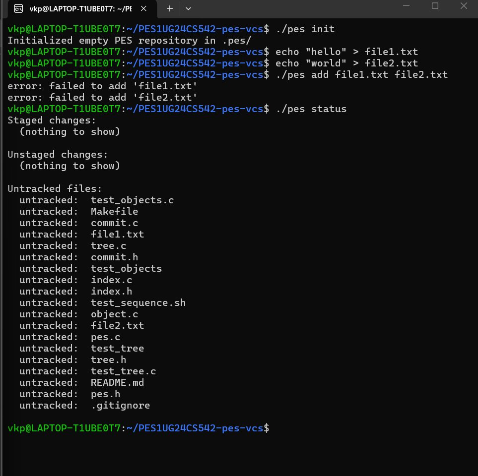
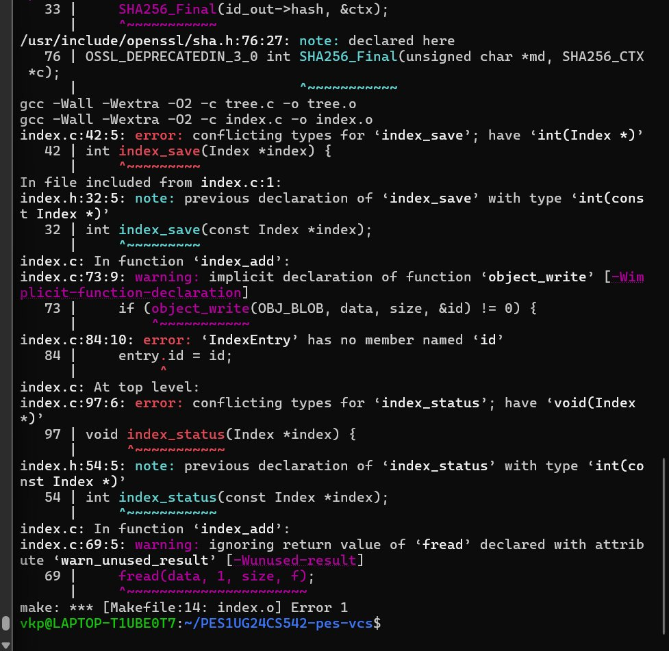
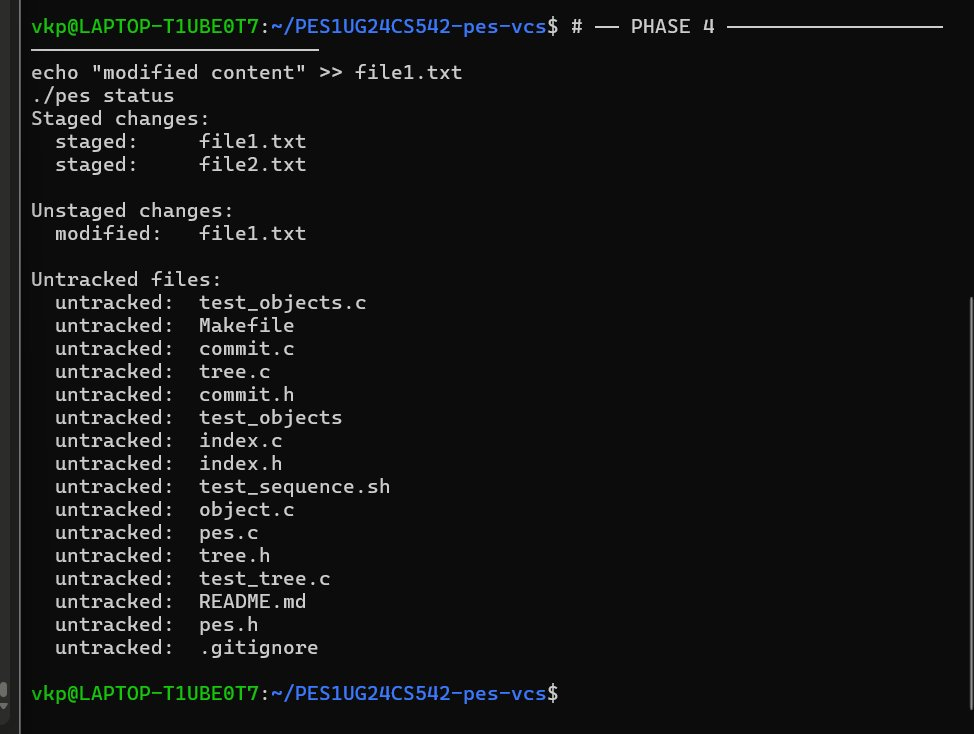
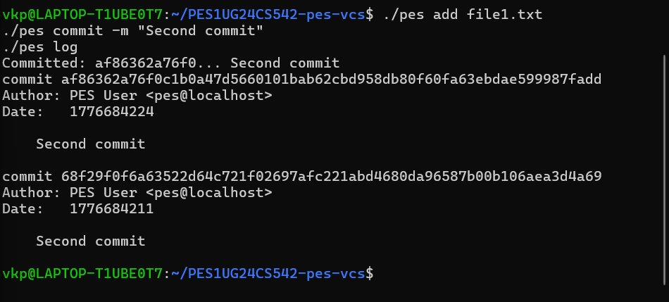
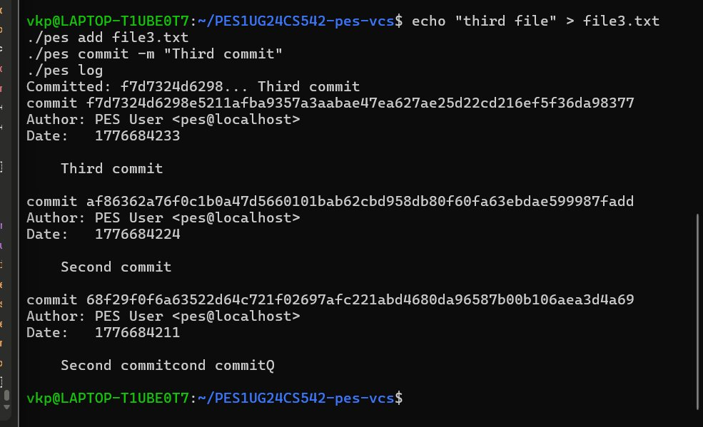

# PES-VCS — Mini Git Implementation

**Name:**  VRUSHANT K P 
**SRN:** PES1UG24CS542  

---

## Phase 1 — Object Store

Implemented `object_write` and `object_read` in `object.c`. Objects are stored under `.pes/objects/XX/YYY...` using SHA-256 content-addressable storage with atomic writes via temp file + rename.

### Screenshots

<!-- Replace these with your actual screenshot images -->

**1A — test_objects passing**

**1B — .pes directory structure**

---

## Phase 2 — Staging Area (Index)

Implemented `index_load`, `index_save`, and `index_add` in `index.c`. The index is stored as a text file with one entry per line in the format: `mode hash mtime size path`. Atomic writes use temp file + rename.

### Screenshots

**2A — pes add + pes status**

**2B — cat .pes/index**

---

## Phase 3 — Commit Creation

Implemented `commit_create` in `commit.c`. A commit snapshots the index into a tree, links to the parent commit, and atomically updates the branch ref via `head_update`.

### Screenshots

**3A — pes commit**

**3B — pes log**

---

## Phase 4 — Multi-Commit History

The `commit_walk` function traverses the parent chain from HEAD to root. `index_status` detects modified files by comparing mtime and size against stored metadata.

### Screenshots

**4A — pes status showing modified file**

**4B — pes log with 2 commits**

**4C — pes log with 3 commits**

---

## Phase 5 — Branching and Checkout (Analysis)

### Q5.1 — How would you implement `pes checkout <branch>`?

Read the target branch file at `.pes/refs/heads/<branch>` to get the tip commit hash. Read that commit to get its root tree hash. Recursively walk the tree, writing each blob's contents back to disk at the correct path. Files with identical blob hashes in both trees require no disk write. Remove any tracked files that exist in the current tree but not the target. Finally, rewrite HEAD to point to the new branch ref.

### Q5.2 — How would you detect a dirty working directory conflict?

Load the current index. For each tracked file, compare mtime and size against stored metadata — if they differ, re-hash the file and compare blob hashes to confirm real modification. Separately, diff the current HEAD tree against the target branch tree to find which files would change on checkout. If a file is both locally modified AND differs between the two branches, that is a conflict — refuse checkout and report those files to the user.

### Q5.3 — What happens in detached HEAD? How to recover?

In detached HEAD, HEAD holds a raw commit hash instead of a `ref: refs/heads/...` pointer. New commits are still created and HEAD advances, but no branch pointer moves. If the user checks out another branch, HEAD is overwritten and the detached commits become unreachable orphans with nothing pointing to them. Recovery: if the user knows the commit hash (from terminal history or a prior `pes log`), manually write that hash into a new file at `.pes/refs/heads/<new-branch>`, then checkout that branch normally.

---

## Phase 6 — Garbage Collection (Analysis)

### Q6.1 — Algorithm to find and delete unreachable objects

**Mark phase:** Build a reachable hash set seeded with all branch tip commit hashes from `.pes/refs/heads/`. For each tip, walk the entire commit chain — mark every commit hash, its root tree hash, all subtree hashes, and all blob hashes. Follow parent pointers until the root commit.

**Sweep phase:** Walk every file under `.pes/objects/XX/YYY...`. Reconstruct each object's hash from its path. If the hash is not in the reachable set, delete the file. After deletion, remove any now-empty shard directories.

For 100,000 commits across 50 branches, the reachable set could reach roughly 3 million objects in the worst case, but deduplication (same file content = same hash = stored once) keeps real counts significantly lower.

### Q6.2 — Race condition between GC and a concurrent commit

A commit writes new blob and tree objects first, then later writes the commit object and updates HEAD. If GC runs its mark phase between these two steps, the new blobs and trees exist on disk but are not yet reachable from any branch. GC deletes them as orphans, leaving the completed commit pointing to missing objects — corruption.

Git prevents this with a **14-day grace period**: GC never deletes any object whose file mtime is younger than the cutoff, regardless of reachability. It also uses a `gc.pid` lock file to signal that GC is running so concurrent operations can detect contention. The atomic `rename()` used for all object writes ensures objects are either fully present or absent, preventing partial-write corruption.
